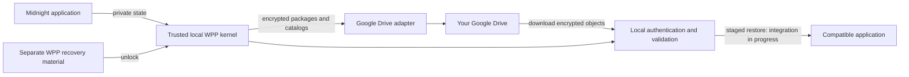

# Witness Protection Program

**Encrypted backup and recovery for Midnight private application data.**

Witness Protection Program (WPP) protects the private data that a Midnight
application needs but the public blockchain cannot restore. Its goal is simple:
connect storage you already own, protect your application state automatically,
and recover it on another compatible device.

**Status: working developer prototype; consumer application in development.**
Local encryption, recovery packs, a ciphertext journal, and encrypted catalog
modules are implemented. A synthetic encrypted package has completed a live
Google Drive upload, download, and authenticated decryption. The complete
application, automatic backup workflow, and Midnight application restore are
still being integrated. WPP's package format is a draft, not a Midnight standard.

## Why it matters

Imagine replacing a lost laptop. You recover your wallet and reconnect to the
blockchain, but an application also depended on private state stored only on
that laptop. Your wallet recovery phrase does not necessarily recreate it.

WPP is being built to protect that missing piece. It encrypts application data
locally, stores the encrypted copies in your cloud account, and checks recovered
data before a compatible application can use it. It does not reconstruct
witnesses from public blockchain history.

## The intended application experience

Google Drive is the first beta destination. The planned flow is:

1. **Connect Google.** WPP opens your system browser. Choose your account and
   approve access through Google's normal sign-in and consent flow.
2. **Set up recovery.** Protect your separate WPP recovery material and complete
   a restore check. A selected Bitwarden secure note is the planned integration;
   an independent encrypted recovery-pack primitive exists today.
3. **Enable protection.** A compatible application supplies private state to
   WPP, which encrypts it locally and verifies the uploaded backup.
4. **Recover on another device.** Reconnect storage, unlock WPP recovery material,
   and restore the selected state into a compatible application.

Ordinary users will not create Google Cloud projects, register OAuth clients,
copy access tokens, or run shell commands. The publisher handles application
registration and release requirements. Account selection, consent, and any MFA
remain Google's normal steps. Signing into Google does not unlock WPP's keys.

The interface is intended to distinguish **Saved on this device**, **Backup
verified**, **Needs attention**, and **Restore checked**. These are product
requirements; there is no released consumer interface yet.

## How the pieces fit together



The local kernel uses a random recovery root, separate from your wallet signing
seed, to derive encryption keys. Authenticated encryption protects packages
before storage adapters receive them. Recovery needs **both the encrypted data
and the appropriate WPP recovery material**, plus access to a compatible
application. Neither a cloud login nor a wallet recovery alone supplies all of
those pieces.

WPP also maintains an **encrypted catalog**: an index that relates packages,
revisions, and storage locations. The catalog is divided into bounded shards so
an update can replace a changed section and its root instead of rewriting the
whole index. Root and shard encryption is implemented; coordinating this layout
through the ordinary cloud backup and restore workflow is still in progress.
Unchanged ciphertext can be shared between revisions without making witness
encryption deterministic.

Read [Understanding WPP](docs/explanation/application.md) for the complete
application model and [encrypted storage layout](docs/explanation/storage-layout.md)
for the research, measurements, and tradeoffs.

## What works today

| Area | On `main` | Remaining application work |
| --- | --- | --- |
| Local protection | Snapshot encryption/decryption, context validation, key epochs, encrypted recovery packs | Application lifecycle integration and production security acceptance |
| Local persistence | Ciphertext journal with restart recovery and filesystem durability checks | Integration with verified remote backup status |
| Encrypted database metadata | Catalog reconciliation, adaptive shard planning, revision validation, authenticated root/shard envelopes | Complete publication, discovery, conflict handling, and cold restore workflow |
| Google Drive | Browser OAuth developer tooling and a verified live synthetic package round trip | Complete consumer connection and backup experience |
| Midnight state | Native format research and explicit codec boundaries | Accepted native capture, staged restore, and application continuation tests |
| Key recovery integrations | Independent encrypted recovery-pack primitives | Bitwarden connection and consumer recovery setup |

The live Drive result establishes one package round trip. It does not establish
a complete sharded database restore or successful continuation of a Midnight
application. No roadmap milestone is claimed complete by this table. See the
[roadmap and acceptance criteria](ROADMAP.md) for the detailed status.

OneDrive, Dropbox, native iCloud Drive access, and Midnight Passport integration
are later targets. Physical storage packs remain an experiment pending real
provider measurements.

## Explore or contribute

Start with the [application explanation](docs/explanation/application.md) and
[documentation index](docs/index.md). Documentation follows Diátaxis and uses
Sphinx with MyST Markdown.

To run the local developer checks, use Node.js 24 or later:

```sh
git clone https://github.com/CharlesHoskinson/WitnessProtectionProgram.git
cd WitnessProtectionProgram
npm ci --ignore-scripts --no-audit --no-fund
npm test
```

These commands build and test the prototype; they do not launch a consumer app
or require your Google account. For specific development tasks:

- [Validate local encryption and recovery](docs/how-to/validate-local-package.md)
- [Reopen the local ciphertext journal](docs/how-to/reopen-local-journal.md)
- [Test the Google Drive round trip](docs/how-to/test-google-drive.md)
- [Build the documentation](docs/tutorials/build-the-docs.md)
- [Review the draft package format](docs/witness-package-format.md)
- [Read the threat model](docs/security-and-recovery.md)
- [Explore research and source evidence](research/README.md)

Cloud providers can still observe object sizes and access patterns. A compromised
unlocked device can expose private data. An authenticated backup can also be old:
WPP must preserve conflicting histories and report uncertain freshness rather
than silently choose the newest timestamp. Production release requires further
integration, recovery testing, and independent security review.
