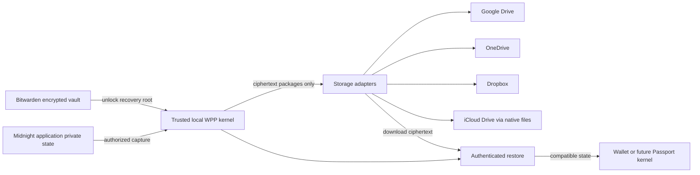

# WitnessProtectionProgram

**Protect your private witnesses. Recover them anywhere.**

WitnessProtectionProgram (WPP) is a project to make Midnight private witness data easy to protect, back up, and move between compatible wallets and machines using storage accounts people already have.

WitnessProtectionProgram (WPP) is a proposed local encryption and recovery layer. Bitwarden protects its recovery roots; a domain-separated hierarchy derives AES keys; Google Drive, OneDrive, Dropbox, and user-selected iCloud Drive folders hold encrypted packages. The eventual integration target is Midnight Passport.

**Project status: public design and implementation roadmap.** The architecture, draft format, source research, and design review are available now. The application is not implemented yet; login buttons, encryption, and cloud backup are planned features. The proposed format is not an adopted Midnight standard.

## Why WPP exists

Midnight applications use private data that the public blockchain cannot reconstruct. Recovering a wallet account or its keys does not necessarily recover that data. Losing a device can therefore mean losing irreplaceable application state even when the wallet itself is recoverable.

WPP aims to make protecting that data a normal part of using a wallet: connect an account, enable protection, and get a clear indication that a recoverable backup exists. The long-term destination is an integrated Midnight Passport feature.

## The planned experience

1. Click **Continue with Apple, Microsoft, Google, or Dropbox** to link a backup account through the provider's own login; connect Bitwarden for key recovery.
2. Complete a restore check to enable protection.
3. Use a compatible Midnight application. Its irreplaceable private state is encrypted and backed up automatically.
4. On another machine, unlock Bitwarden, reconnect storage, and restore into a compatible wallet.

The interface distinguishes **Saved on this device**, **Backup verified**, **Needs attention**, and **Restore checked**. Copying a file into a sync folder does not establish a verified remote backup.

## How it works

- **An HD hierarchy for AES keys.** A random recovery root derives separate encryption keys for namespaces and record revisions using HKDF-SHA-256. It is independent of the wallet's signing seed.
- **Bitwarden protects recovery material.** A selected encrypted vault item holds the WPP root record. The trusted local WPP component encrypts witness packages before they reach storage.
- **Portable, authenticated packages.** AES-256-GCM protects both private contents and identifying metadata. A versioned wrapper preserves Midnight.js native export fields and supports application-specific witness codecs.
- **Storage the user already owns.** Google Drive, OneDrive, Dropbox, and native iCloud Drive file access are the planned backends, alongside encrypted file export/import.
- **Recovery is tested.** Download, authenticate, validate the destination account and application, stage the restore, and activate only after checks pass.

### Simple account linking

| Provider | Planned connection experience |
|---|---|
| Google | Continue with Google → provider consent → connected Drive destination |
| Microsoft | Continue with Microsoft → provider consent → connected OneDrive destination |
| Dropbox | Continue with Dropbox → provider consent → connected Dropbox destination |
| Apple | Continue with Apple → native iCloud Drive folder permission on supported platforms |

The publisher handles developer registration and OAuth configuration. End users do not create API keys, paste tokens, or run shell commands. Provider account selection, MFA, and consent remain part of the normal provider flow. Cloud login and Bitwarden unlock serve separate purposes.

## Design

- [Architecture and decisions](docs/superpowers/specs/2026-09-13-witness-protection-program-design.md)
- [Portable witness package, draft v0.1](docs/witness-package-format.md)
- [Threat model and recovery](docs/security-and-recovery.md)
- [Storage providers and Passport integration](docs/integrations.md)
- [Google Drive beta: one-click setup and implementation checklist](docs/google-drive-beta.md)
- [Implementation roadmap and acceptance criteria](ROADMAP.md)
- [Source evidence and repository graphs](research/README.md)

Midnight.js already has a `midnight-private-state-export` format. The WPP design preserves that native export inside its own encrypted envelope and provides for separately registered codecs for application witness records. It does not obtain private witnesses from the public chain.



Apple login is paired with native iCloud Drive folder permission where supported. End users do not configure API keys or paste tokens. Cloud providers can observe object sizes and access patterns. A compromised unlocked endpoint can expose data. Recovering the encryption root does not recreate missing witness bytes or authorize spending from a wallet.

## Start here

Feature documentation uses **Diátaxis and Sphinx**. See the [documentation index](docs/index.md) and [local build tutorial](docs/tutorials/build-the-docs.md). Google Drive is the first planned beta provider; its [official documentation corpus](research/google-drive/README.md) covers OAuth, Picker, Drive APIs and publisher setup.

```sh
git clone https://github.com/CharlesHoskinson/WitnessProtectionProgram.git
cd WitnessProtectionProgram
```

Read the [architecture](docs/superpowers/specs/2026-09-13-witness-protection-program-design.md), then the [roadmap](ROADMAP.md). There is no application install or run command yet. The first implementation milestone is an interoperable package format and local encryption/restore core, followed by Bitwarden recovery and provider login integrations.

## Research and review

The local research corpus covers 76 Midnight repositories, 68 Bitwarden repositories, and LFDT-Minokawa Compact. Terra generated structural graphs and selected semantic evidence; documentation-only fallbacks and coverage limits are recorded separately. Large generated graphs stay outside this repository. See the [research guide](research/README.md) and [Terra design review](research/reviews/README.md).

Passport integration depends on a released, version-pinned API that supports the required capture and storage boundaries. Production encryption requires independent vectors, interoperability tests, restore fault tests, and security review. Those are implementation acceptance criteria, not completed results.
