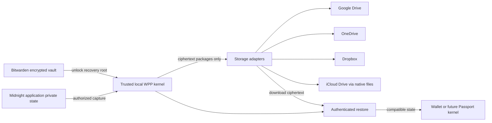

# WitnessProtectionProgram

Keep Midnight private witness data recoverable across wallets, machines, and the storage accounts people already use.

WitnessProtectionProgram (WPP) is a proposed local encryption and recovery layer. Bitwarden protects its recovery roots; a domain-separated hierarchy derives AES keys; Google Drive, OneDrive, Dropbox, and user-selected iCloud Drive folders hold encrypted packages. The eventual integration target is Midnight Passport.

**Status: design repository. No wallet, encryption implementation, cloud integration, or Passport integration has shipped. The proposed format is not an adopted Midnight standard.**

## The experience

1. Click **Continue with Apple, Microsoft, Google, or Dropbox** to link a backup account through the provider's own login; connect Bitwarden for key recovery.
2. Complete a restore check to enable protection.
3. Use a compatible Midnight application. Its irreplaceable private state is encrypted and backed up automatically.
4. On another machine, unlock Bitwarden, reconnect storage, and restore into a compatible wallet.

The interface distinguishes **Saved on this device**, **Backup verified**, **Needs attention**, and **Restore checked**. Copying a file into a sync folder does not establish a verified remote backup.

## Design

- [Architecture and decisions](docs/superpowers/specs/2026-09-13-witness-protection-program-design.md)
- [Portable witness package, draft v0.1](docs/witness-package-format.md)
- [Threat model and recovery](docs/security-and-recovery.md)
- [Storage providers and Passport integration](docs/integrations.md)
- [Implementation roadmap and acceptance criteria](ROADMAP.md)
- [Source evidence and repository graphs](research/README.md)

Midnight.js already has a `midnight-private-state-export` format. WPP preserves that native export inside its own encrypted envelope and supports separately registered codecs for application witness records. It does not obtain private witnesses from the public chain.

Apple login is paired with native iCloud Drive folder permission where supported. End users do not configure API keys or paste tokens. Cloud providers can observe object sizes and access patterns. A compromised unlocked endpoint can expose data. Recovering the encryption root does not recreate missing witness bytes or authorize spending from a wallet.
